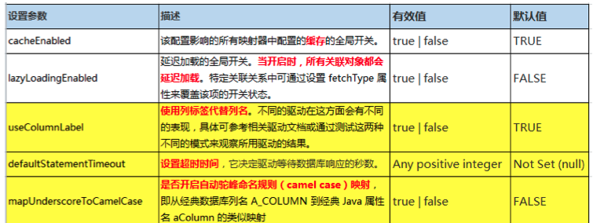
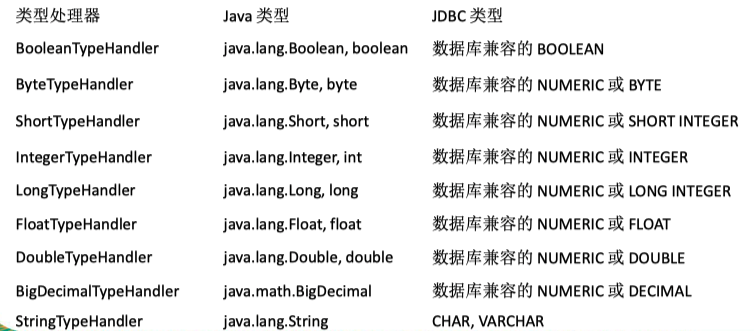

## 前言

MyBatis 的配置文件包含了影响 MyBatis 行为的设置（settings）和属性（properties）信息。

其文档的顶层结构如下：

- configuration 配置

-  properties 属性
-  settings 设置
-  typeAliases 类型命名
-  typeHandlers 类型处理器
-  objectFactory 对象工厂
-  plugins 插件
-  environments 环境
   -  environment 环境变量
   -  transactionManager 事务管理器
   -  dataSource 数据源

- databaseIdProvider 数据库厂商标识

- mappers 映射器


## properties属性

properties 可以用来引入mybatis中一些属性所对应的值。

- 如果按照文件类型来引入，则采用resource来引入；

- 如果按照值来引入，则采用property标签。

如下所示：

```xml
<-- 引入properties文件!-->
<properties resource="dbconfig.properties"></properties>
<-- 引入property值!-->
<property name="driver" value="com.mysql.jdbc.Driver" />
```

如果属性在不只一个地方进行了配置，那么 MyBatis 将按 照下面的顺序来加载：

1. 在 properties 元素体内指定的属性首先被读取。
2. 然后根据 properties 元素中的 resource 属性读取类路径下属性文件或根 据 url 属性指定的路径读取属性文件，并覆盖已读取的同名属性。
3. 最后读取作为方法参数传递的属性，并覆盖已读取的同名属性。


## settings设置

这是 MyBatis 中极为重要的调整设置，它们会改变 MyBatis 的运行时行为。

常见的设置有如下这些：



在日常开发中，经常会设置mapUnderscoreToCamelCase属性，将数据库存储的下划线风格的字段转化为代码中的驼峰命名规则 。

```xml
	<settings>
		<setting name="mapUnderscoreToCamelCase" value="true"/>
	</settings>
```


## typeAliases 别名处理器

类型别名的作用，是为 Java 类型设置一个短的名字，可以方便我们 引用某个类。

在类很多的情况下，可以批量设置别名这个包下的每一个类 创建一个默认的别名，就是简单类名小写。

如：

```xml
<typeAliases>
		<package name="com.sxl.config.bean"/>
</typeAliases>		
```

若bean目录下有User,Emoplyee两个类，则上述的作用等价于

```xml
<typeAlias type="com.sxl.config.bean.User" alias="user"/> 
<typeAlias type="com.sxl.config.bean.Employee" alias="employee"/> 
```

需要注意的是，MyBatis已经为许多常见的 Java 类型内建 了相应的类型别名。它们都是大小写不敏感的，我们在起 别名的时候千万不要占用已有的别名。


## typeHandlers类型处理器

无论是 MyBatis 在预处理语句（PreparedStatement）中 设置一个参数时，还是从结果集中取出一个值时， 都会 用类型处理器将获取的值以合适的方式转换成 Java 类型。各个处理器所处理的范围如下：




## plugins插件

plugins插件

 插件是MyBatis提供的一个非常强大的机制，我们 可以通过插件来修改MyBatis的一些核心行为。插 件通过动态代理机制，可以介入四大对象的任何 一个方法的执行。

```java
Executor (update, query, flushStatements, commit, rollback, getTransaction, close, isClosed)
ParameterHandler (getParameterObject, setParameters)
ResultSetHandler (handleResultSets, handleOutputParameters)
StatementHandler (prepare, parameterize, batch, update, query)
```


## environments环境

MyBatis可以配置多种环境，比如开发、测试和生 产环境需要有不同的配置。

- 每种环境使用一个environment标签进行配置并指 定唯一标识符

- 可以通过environments标签中的default属性指定 一个环境的标识符来快速的切换环境

如：

```xml
	<environments default="development">
		<environment id="development">
			<transactionManager type="JDBC" />
			<dataSource type="POOLED">
				<property name="driver" value="com.mysql.jdbc.Driver" />
				<property name="url" value="jdbc:mysql://localhost:3306/mybatis_learn" />
				<property name="username" value="root" />
				<property name="password" value="123456" />
			</dataSource>
		</environment>
	</environments>
```


## transactionManager

type： JDBC | MANAGED | 自定义

- JDBC： 

使用了 JDBC 的提交和回滚设置，依赖于从**数据源得到的连接来管理事务范围。** JdbcTransactionFactory

- MANAGED：

不提交或回滚一个连接、**让容器来管理事务的整个生命周期**（比如 JEE 应用服务器的上下 文）。 ManagedTransactionFactory

- 自定义：

实现TransactionFactory接口，type=全类名/ 别名


## dataSource

type： UNPOOLED | POOLED | JNDI | 自定义

- UNPOOLED：

不使用连接池， UnpooledDataSourceFactory

- POOLED：

使用连接池， PooledDataSourceFactory

- JNDI： 

在EJB 或应用服务器这类容器中查找指定的数 据源

- 自定义：

实现DataSourceFactory接口，定义数据源的 获取方式。

实际开发中我们使用Spring管理数据源，并进行 事务控制的配置来覆盖上述配置.

## mapper映射

- mapper逐个注册SQL映射

```xml
<mapper resource="com/sxl/config/mapper/EmployeeMapper.xml" />
<mapper resource="com/sxl/config/mapper/EmployeeMapper.xml" />
```

- 使用批量注册：

```
<!-- 批量注册： -->
<package name="com.sxl.config.mapper"/>
```

这种方式要求**SQL映射文件名必须和接口名相同并且在同一目录下.**

